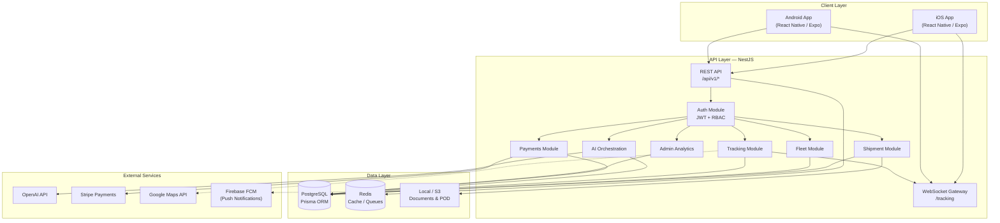
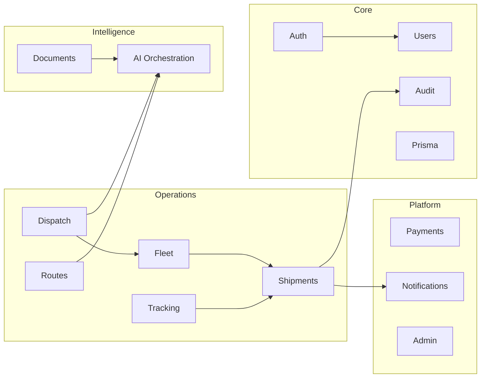
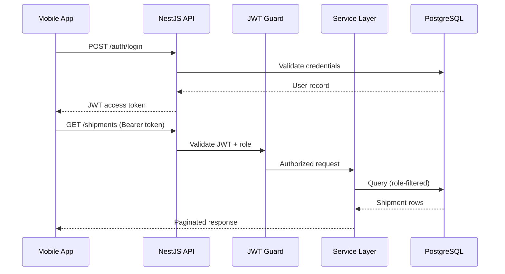
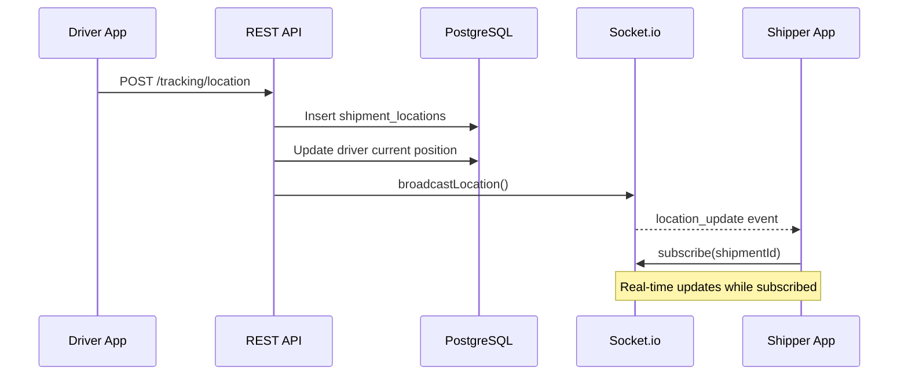
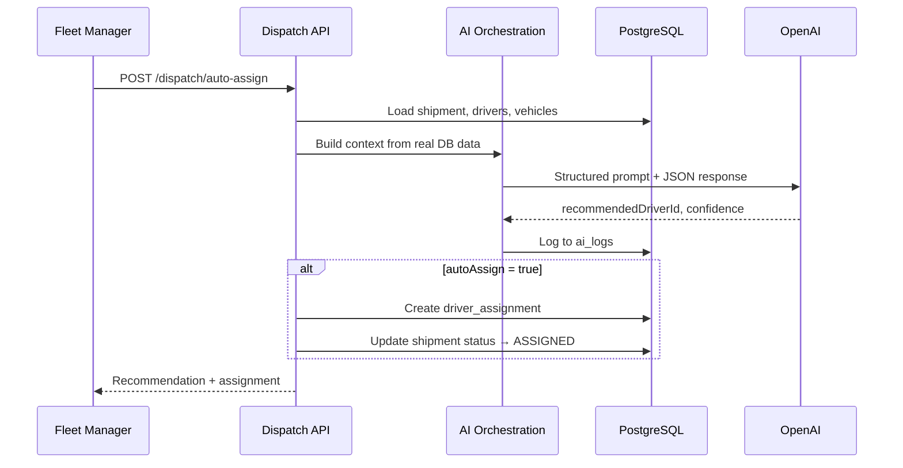
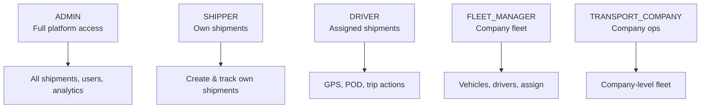
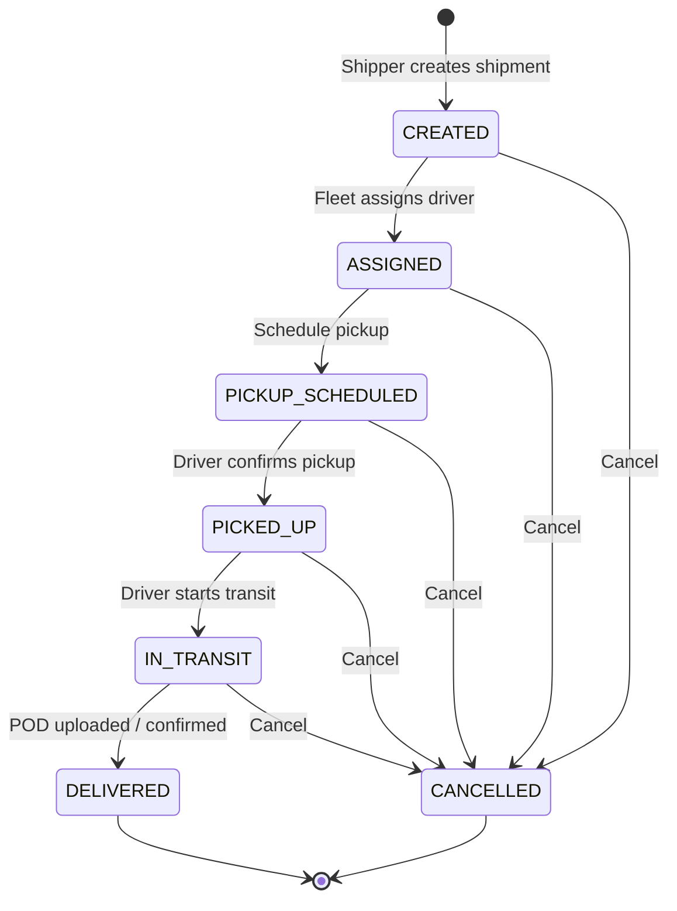

# LogistiQ AI — Logistics Platform

Production-ready, AI-powered logistics platform for iOS and Android. Connects **shippers**, **transport companies**, **fleet managers**, **drivers**, and **admins** through a single system for shipment management, real-time GPS tracking, fleet operations, payments, and intelligent automation.

---

## Table of Contents

1. [System Architecture](#system-architecture)
2. [Data Flow](#data-flow)
3. [Database Schema](#database-schema)
4. [Project Structure](#project-structure)
5. [Tech Stack](#tech-stack)
6. [User Roles & Permissions](#user-roles--permissions)
7. [Shipment Lifecycle](#shipment-lifecycle)
8. [API Reference](#api-reference)
9. [AI Services](#ai-services)
10. [Mobile App](#mobile-app)
11. [Quick Start](#quick-start)
12. [Environment Variables](#environment-variables)
13. [Deployment](#deployment)
14. [Security](#security)

---

## System Architecture

High-level view of how clients, services, and external providers interact.



### Backend Module Map



| Module | Responsibility |
|--------|----------------|
| `auth` | Register, login, JWT issuance, Passport strategy |
| `users` | Profile read/update, driver verification metadata |
| `shipments` | CRUD, status transitions, documents, proof of delivery |
| `fleet` | Vehicles, drivers, assignments, utilization, maintenance list |
| `tracking` | GPS ingest, location history, Socket.io broadcast |
| `routes` | AI route optimization endpoint |
| `dispatch` | AI auto-assign driver/vehicle |
| `documents` | OCR / document field extraction |
| `ai` | Chat, ETA, load optimize, demand forecast, anomaly, maintenance |
| `payments` | Stripe checkout sessions, payment history |
| `notifications` | In-app notification records |
| `admin` | Analytics dashboard, user management |
| `audit` | Immutable audit log for sensitive actions |

---

## Data Flow

### Authentication & API Request



### Live GPS Tracking



### AI Dispatch Flow



---

## Database Schema

PostgreSQL database managed by **Prisma**. All tables use UUID primary keys and snake_case column mapping.

### Entity Relationship Diagram

```mermaid
erDiagram
    companies ||--o{ users : employs
    companies ||--o{ drivers : has
    companies ||--o{ vehicles : owns

    users ||--o| drivers : "is (DRIVER role)"
    users ||--o{ shipments : creates
    users ||--o{ notifications : receives
    users ||--o{ support_chats : sends
    users ||--o{ audit_logs : performs

    drivers ||--o{ driver_assignments : assigned
    drivers ||--o{ fuel_logs : logs

    vehicles ||--o{ driver_assignments : used_in
    vehicles ||--o{ vehicle_maintenance : requires
    vehicles ||--o{ fuel_logs : consumes

    shipments ||--o{ shipment_items : contains
    shipments ||--o{ shipment_documents : has
    shipments ||--o{ shipment_status_history : tracks
    shipments ||--o{ shipment_locations : gps
    shipments ||--o{ shipment_tracking_events : events
    shipments ||--o{ driver_assignments : assigned
    shipments ||--o{ payments : billed
    shipments ||--o{ invoices : invoiced
    shipments ||--o{ routes : routed
    shipments ||--o{ anomaly_alerts : flagged

    routes ||--o{ route_stops : includes

    companies {
        uuid id PK
        string name
        boolean is_verified
    }

    users {
        uuid id PK
        string email UK
        string password_hash
        enum role
        uuid company_id FK
        boolean is_verified
    }

    drivers {
        uuid id PK
        uuid user_id FK UK
        uuid company_id FK
        float rating
        float current_lat
        float current_lng
        boolean is_available
    }

    vehicles {
        uuid id PK
        uuid company_id FK
        string plate_number UK
        enum status
        float capacity_weight
        float capacity_volume
    }

    shipments {
        uuid id PK
        string tracking_number UK
        uuid shipper_id FK
        enum status
        enum priority
        float weight
        string pickup_city
        string delivery_city
        datetime estimated_delivery_at
        float eta_confidence
    }

    driver_assignments {
        uuid id PK
        uuid shipment_id FK
        uuid driver_id FK
        uuid vehicle_id FK
        boolean is_active
    }

    shipment_locations {
        uuid id PK
        uuid shipment_id FK
        float latitude
        float longitude
        datetime recorded_at
    }

    payments {
        uuid id PK
        uuid shipment_id FK
        float amount
        enum status
        string stripe_session_id
    }

    ai_logs {
        uuid id PK
        string service
        string prompt
        string response
        json metadata
    }

    anomaly_alerts {
        uuid id PK
        uuid shipment_id FK
        enum type
        string severity
        boolean is_resolved
    }

    audit_logs {
        uuid id PK
        uuid user_id FK
        string action
        string entity_type
        uuid entity_id
        json old_value
        json new_value
    }
```

### Table Reference (25 tables)

| Domain | Table | Purpose |
|--------|-------|---------|
| **Identity** | `users` | Accounts with role and company link |
| | `companies` | Transport company profiles |
| | `drivers` | Driver profile, rating, live GPS |
| **Fleet** | `vehicles` | Fleet vehicles and capacity |
| | `vehicle_maintenance` | Scheduled and predictive maintenance |
| | `fuel_logs` | Fuel consumption records |
| **Shipments** | `shipments` | Core shipment records |
| | `shipment_items` | Line items (weight, fragile, SKU) |
| | `shipment_documents` | Uploaded docs + OCR JSON |
| | `shipment_status_history` | Every status change (auditable) |
| | `shipment_locations` | Timestamped GPS breadcrumbs |
| | `shipment_tracking_events` | Pickup, delay, issue events |
| **Routing** | `routes` | Optimized route metadata |
| | `route_stops` | Ordered stops with ETA |
| **Assignments** | `driver_assignments` | Shipment ↔ driver ↔ vehicle |
| **Billing** | `payments` | Stripe-linked payments |
| | `invoices` | Generated invoices |
| **Comms** | `notifications` | In-app alerts |
| | `support_chats` | User + AI chat history |
| **AI & Ops** | `ai_logs` | All AI prompt/response audit trail |
| | `anomaly_alerts` | Fraud / deviation flags |
| | `audit_logs` | Sensitive action audit trail |

### Key Enums

| Enum | Values |
|------|--------|
| `UserRole` | `ADMIN`, `SHIPPER`, `DRIVER`, `FLEET_MANAGER`, `TRANSPORT_COMPANY` |
| `ShipmentStatus` | `CREATED` → `ASSIGNED` → `PICKUP_SCHEDULED` → `PICKED_UP` → `IN_TRANSIT` → `DELIVERED` / `CANCELLED` |
| `VehicleStatus` | `AVAILABLE`, `IN_USE`, `MAINTENANCE`, `OUT_OF_SERVICE` |
| `PaymentStatus` | `PENDING`, `PROCESSING`, `COMPLETED`, `FAILED`, `REFUNDED` |
| `AnomalyType` | `ROUTE_DEVIATION`, `DUPLICATE_INVOICE`, `UNEXPECTED_STOP`, `PAYMENT_ANOMALY`, `DRIVER_BEHAVIOR`, `SUSPICIOUS_ACTIVITY` |

Schema source: [`apps/api/prisma/schema.prisma`](apps/api/prisma/schema.prisma)

---

## Project Structure

```
logistics-platform/
│
├── apps/
│   ├── api/                              # NestJS backend
│   │   ├── prisma/
│   │   │   ├── schema.prisma             # Database schema (source of truth)
│   │   │   ├── seed.ts                   # Demo users, company, vehicle
│   │   │   └── migrations/               # SQL migrations
│   │   ├── src/
│   │   │   ├── main.ts                   # App bootstrap, Swagger, CORS
│   │   │   ├── app.module.ts             # Root module wiring
│   │   │   │
│   │   │   ├── auth/                     # Login, register, JWT
│   │   │   ├── users/                    # GET/PATCH /users/me
│   │   │   ├── shipments/                # Shipment CRUD + status + POD
│   │   │   ├── fleet/                    # Vehicles, drivers, assignments
│   │   │   ├── tracking/                 # GPS API + Socket.io gateway
│   │   │   ├── routes/                   # POST /routes/optimize
│   │   │   ├── dispatch/                 # POST /dispatch/auto-assign
│   │   │   ├── documents/                # POST /documents/process (OCR)
│   │   │   ├── ai/
│   │   │   │   ├── ai-orchestration.service.ts
│   │   │   │   └── prompts/index.ts      # All AI prompts (isolated)
│   │   │   ├── payments/                 # Stripe checkout
│   │   │   ├── notifications/            # In-app notifications
│   │   │   ├── admin/                    # Analytics + user mgmt
│   │   │   ├── audit/                    # Global audit logger
│   │   │   ├── prisma/                   # PrismaService (global)
│   │   │   └── common/
│   │   │       ├── guards/               # JwtAuthGuard, RolesGuard
│   │   │       └── decorators/           # @Roles, @Public, @CurrentUser
│   │   ├── uploads/                      # Document & POD storage
│   │   └── Dockerfile                    # Production API image
│   │
│   └── mobile/                           # React Native (Expo) app
│       ├── app/                          # Expo Router screens (file-based)
│       │   ├── index.tsx                 # Splash → auth redirect
│       │   ├── _layout.tsx               # Root layout
│       │   ├── (auth)/
│       │   │   ├── login.tsx
│       │   │   ├── register.tsx
│       │   │   └── role-selection.tsx
│       │   └── (app)/                    # Authenticated tab navigator
│       │       ├── index.tsx             # Role-based dashboard
│       │       ├── shipments.tsx
│       │       ├── shipment/[id].tsx     # Detail + status actions
│       │       ├── create-shipment.tsx
│       │       ├── tracking.tsx          # Live map + WebSocket
│       │       ├── active-trip.tsx         # Driver GPS loop
│       │       ├── proof-of-delivery.tsx
│       │       ├── payment.tsx
│       │       ├── fleet.tsx
│       │       ├── notifications.tsx
│       │       ├── ai-chat.tsx
│       │       └── profile.tsx
│       ├── src/
│       │   ├── components/               # Button, Input, MapTracking, etc.
│       │   ├── stores/                   # Zustand (auth, shipments)
│       │   ├── services/                 # API client, tracking socket
│       │   └── config.ts                 # API_URL, WS_URL
│       └── assets/                       # App icon, splash
│
├── packages/
│   └── shared/                           # Shared between API & mobile
│       └── src/
│           ├── types.ts                  # Enums, interfaces
│           └── schemas.ts                # Zod validation schemas
│
├── docker/
│   └── docker-compose.yml                # PostgreSQL 16 + Redis 7
│
├── .github/workflows/
│   └── ci.yml                            # Lint, build, test, migrate
│
├── .env.example                          # All environment variables
├── package.json                          # npm workspaces root
└── README.md
```

### Where to look for common tasks

| Task | Location |
|------|----------|
| Add API endpoint | `apps/api/src/<module>/` |
| Change DB schema | `apps/api/prisma/schema.prisma` → run migrate |
| Add mobile screen | `apps/mobile/app/(app)/` |
| Shared types / validation | `packages/shared/src/` |
| AI prompt changes | `apps/api/src/ai/prompts/index.ts` |
| Role permissions | `apps/api/src/common/guards/` + service `assertAccess` methods |
| Real-time events | `apps/api/src/tracking/tracking.gateway.ts` |

---

## Tech Stack

| Layer | Technology |
|-------|-----------|
| **Mobile** | React Native 0.76, Expo 52, TypeScript |
| **Mobile UI** | NativeWind (Tailwind CSS) |
| **Mobile State** | Zustand |
| **Mobile Navigation** | Expo Router + React Navigation |
| **Backend** | NestJS 10, TypeScript |
| **ORM / DB** | Prisma 6, PostgreSQL 16 |
| **Cache** | Redis 7 |
| **Realtime** | Socket.io |
| **Auth** | JWT, Passport, bcrypt |
| **Validation** | Zod (shared), class-validator (API) |
| **AI** | OpenAI API |
| **Payments** | Stripe |
| **Maps** | react-native-maps, Google Maps API |
| **CI/CD** | GitHub Actions |
| **Containers** | Docker, Docker Compose |

---

## User Roles & Permissions



| Action | Admin | Shipper | Driver | Fleet Mgr | Transport Co. |
|--------|:-----:|:-------:|:------:|:---------:|:-------------:|
| View all shipments | ✅ | ❌ | ❌ | Company only | Company only |
| Create shipment | ✅ | ✅ | ❌ | ❌ | ❌ |
| Update GPS location | ✅ | ❌ | ✅ | ❌ | ❌ |
| Upload proof of delivery | ✅ | ❌ | ✅ | ❌ | ❌ |
| Assign driver/vehicle | ✅ | ❌ | ❌ | ✅ | ✅ |
| Manage fleet | ✅ | ❌ | ❌ | ✅ | ✅ |
| Admin analytics | ✅ | ❌ | ❌ | ❌ | ❌ |
| Pay for shipment | ✅ | ✅ | ❌ | ❌ | ❌ |

---

## Shipment Lifecycle

Valid status transitions are enforced server-side in `ShipmentsService`.



Every transition is written to `shipment_status_history` and triggers a notification to the shipper.

---

## API Reference

Base URL: `http://localhost:3000/api/v1`  
Swagger UI: `http://localhost:3000/api/docs`

| Method | Endpoint | Auth | Description |
|--------|----------|------|-------------|
| `POST` | `/auth/register` | Public | Register new user |
| `POST` | `/auth/login` | Public | Login, returns JWT |
| `GET` | `/users/me` | JWT | Current user profile |
| `PATCH` | `/users/me` | JWT | Update profile |
| `POST` | `/shipments` | JWT | Create shipment |
| `GET` | `/shipments` | JWT | List (role-filtered) |
| `GET` | `/shipments/:id` | JWT | Shipment detail |
| `PATCH` | `/shipments/:id/status` | JWT | Update status |
| `POST` | `/shipments/:id/documents` | JWT | Upload document |
| `POST` | `/shipments/:id/proof-of-delivery` | JWT | Upload POD |
| `POST` | `/tracking/location` | JWT | GPS update (driver) |
| `GET` | `/tracking/:shipmentId` | JWT | Tracking history |
| `POST` | `/routes/optimize` | JWT | AI route optimization |
| `POST` | `/dispatch/auto-assign` | JWT | AI driver assignment |
| `POST` | `/documents/process` | JWT | OCR extraction |
| `POST` | `/ai/chat` | JWT | AI support chat |
| `POST` | `/ai/eta` | JWT | ETA prediction |
| `GET` | `/fleet/vehicles` | JWT | List vehicles |
| `POST` | `/fleet/vehicles` | JWT | Create vehicle |
| `GET` | `/fleet/drivers` | JWT | List drivers |
| `POST` | `/fleet/assign` | JWT | Manual assignment |
| `GET` | `/fleet/utilization` | JWT | Utilization dashboard |
| `POST` | `/payments/checkout` | JWT | Stripe checkout |
| `GET` | `/payments/history` | JWT | Payment history |
| `GET` | `/notifications` | JWT | List notifications |
| `GET` | `/admin/analytics` | Admin | Platform analytics |

---

## AI Services

All AI calls go through `AiOrchestrationService`. Prompts live in **`apps/api/src/ai/prompts/index.ts`** — never inline in business logic.

| Service | Endpoint | Input | Output |
|---------|----------|-------|--------|
| Route optimization | `POST /routes/optimize` | Shipment IDs | Ordered route, distance, ETA, confidence |
| ETA prediction | `POST /ai/eta` | Shipment ID | `estimatedDeliveryAt`, confidence, factors |
| Load optimization | `POST /ai/load-optimize` | Shipment ID | Load order, warnings |
| Auto dispatch | `POST /dispatch/auto-assign` | Shipment ID | Recommended driver/vehicle + score |
| Demand forecast | `POST /ai/demand-forecast` | Historical data | Area/date forecasts |
| Chat assistant | `POST /ai/chat` | Message + optional shipmentId | Grounded reply from DB |
| Document OCR | `POST /documents/process` | OCR text | Extracted fields + confidence |
| Anomaly detection | `POST /ai/anomaly-check` | Shipment ID | Alerts with severity |
| Predictive maintenance | `POST /ai/maintenance-predict` | Vehicle ID | Scheduled maintenance predictions |

### AI Safety Rules

- **Never invent** shipment statuses, prices, ETAs, or driver locations
- Always query **real database context** before responding
- Return **confidence scores** and `dataLimitations` when data is incomplete
- Log every call to `ai_logs` for auditability

---

## Mobile App

### Screen Map by Role

| Screen | Shipper | Driver | Fleet Mgr | Admin |
|--------|:-------:|:------:|:---------:|:-----:|
| Dashboard | ✅ | ✅ | ✅ | ✅ |
| Create Shipment | ✅ | | | ✅ |
| Shipment Detail | ✅ | ✅ | ✅ | ✅ |
| Live Tracking | ✅ | | ✅ | ✅ |
| Active Trip | | ✅ | | |
| Proof of Delivery | | ✅ | | |
| Fleet Management | | | ✅ | ✅ |
| Payments | ✅ | | | |
| AI Chat | ✅ | ✅ | ✅ | ✅ |
| Notifications | ✅ | ✅ | ✅ | ✅ |

### Mobile Architecture

```
app/ (Expo Router)
  └── screens trigger
        └── Zustand stores (authStore, shipmentStore)
              └── services/api.ts (HTTP + retry)
              └── services/tracking.ts (Socket.io)
                    └── NestJS API
```

---

## Quick Start

### Prerequisites

- **Node.js** 20+
- **Docker** & Docker Compose
- **Expo Go** app on a physical device (optional)

### 1. Clone & configure

```bash
git clone <repo-url>
cd logistics-platform
cp .env.example .env
```

### 2. Start infrastructure

```bash
npm run docker:up          # PostgreSQL + Redis
```

### 3. Install & migrate

```bash
npm install
npm run db:generate
cd apps/api && npx prisma migrate deploy && npm run prisma:seed
cd ../..
```

### 4. Run API

```bash
npm run api:dev
# → http://localhost:3000/api/v1
# → http://localhost:3000/api/docs
```

### 5. Run mobile

```bash
npm run mobile:start
# Scan QR with Expo Go, or:
npm run mobile:ios
npm run mobile:android
```

### Demo Accounts

| Role | Email | Password |
|------|-------|----------|
| Admin | `admin@logistics.com` | `Password123!` |
| Shipper | `shipper@example.com` | `Password123!` |
| Fleet Manager | `fleet@acmelogistics.com` | `Password123!` |
| Driver | `driver@acmelogistics.com` | `Password123!` |

### npm Scripts

| Command | Description |
|---------|-------------|
| `npm run api:dev` | Start API in watch mode |
| `npm run api:build` | Build API for production |
| `npm run api:test` | Run API unit tests |
| `npm run mobile:start` | Start Expo dev server |
| `npm run docker:up` | Start PostgreSQL + Redis |
| `npm run docker:down` | Stop containers |
| `npm run db:generate` | Generate Prisma client |
| `npm run db:seed` | Seed demo data |

---

## Environment Variables

Copy `.env.example` and fill in values:

| Variable | Required | Description |
|----------|----------|-------------|
| `DATABASE_URL` | ✅ | PostgreSQL connection string |
| `JWT_SECRET` | ✅ | JWT signing secret (32+ chars in prod) |
| `PORT` | | API port (default `3000`) |
| `REDIS_URL` | | Redis connection |
| `OPENAI_API_KEY` | | Enables AI features |
| `OPENAI_MODEL` | | Model name (default `gpt-4o-mini`) |
| `STRIPE_SECRET_KEY` | | Enables Stripe checkout |
| `GOOGLE_MAPS_API_KEY` | | Maps & routing |
| `EXPO_PUBLIC_API_URL` | | Mobile → API URL |
| `EXPO_PUBLIC_WS_URL` | | Mobile → WebSocket URL |

---

## Deployment

### API (Docker)

```bash
docker build -f apps/api/Dockerfile -t logistics-api .
docker run -p 3000:3000 --env-file .env logistics-api
```

The container runs `prisma migrate deploy` on startup, then starts the NestJS server.

### Mobile (EAS Build)

```bash
cd apps/mobile
npx eas build --platform ios
npx eas build --platform android
```

### CI Pipeline

GitHub Actions (`.github/workflows/ci.yml`) runs on every push:

1. Start PostgreSQL service container
2. `npm install` → build shared package
3. Prisma generate + migrate
4. API build + Jest tests
5. Mobile TypeScript check

---

## Security

| Control | Implementation |
|---------|----------------|
| Authentication | JWT bearer tokens, bcrypt password hashing |
| Authorization | Global `JwtAuthGuard` + `@Roles()` decorator |
| Data isolation | Service-layer `assertAccess()` per role |
| Audit trail | `audit_logs` for login, payments, status changes, POD |
| Status integrity | Validated state machine transitions |
| GPS integrity | All locations timestamped in `shipment_locations` |
| AI grounding | DB-only context in prompts; confidence scores required |
| Payments | Stripe-hosted checkout; payment records auditable |

---

## License

Proprietary — All rights reserved.
